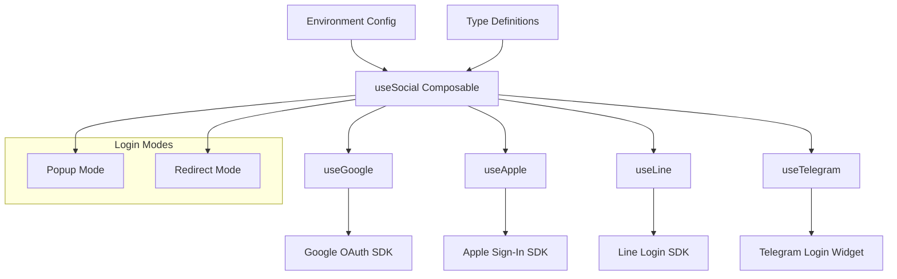

# Design Document

## Overview

本設計文件描述了一個基於 Nuxt 3 的社交登入系統架構，提供 Google、Apple、Line 和 Telegram 四個平台的第三方登入整合。系統採用 composable 模式設計，提供個別平台的專用 composable 以及統一管理的 useSocial composable，支援彈窗和重導向兩種登入模式。

## Architecture

### 系統架構圖



### 核心設計原則

1. **模組化設計** - 每個社交平台獨立實作，可單獨使用
2. **統一介面** - useSocial 提供一致的 API 介面
3. **類型安全** - 完整的 TypeScript 類型定義
4. **環境配置** - 透過 .env 管理敏感資訊
5. **彈性模式** - 支援彈窗和重導向兩種登入方式

## Components and Interfaces

### 核心 Composables

#### 1. useSocial (統一管理)
```typescript
interface SocialLoginOptions {
  popup?: boolean
  redirectUrl?: string
}

interface SocialLoginResult {
  success: boolean
  user?: SocialUser
  error?: SocialError
  platform: SocialPlatform
}

interface SocialUser {
  id: string
  email?: string
  name?: string
  avatar?: string
  platform: SocialPlatform
  accessToken: string
  refreshToken?: string
}

const useSocial = () => {
  const loginWithGoogle: (options?: SocialLoginOptions) => Promise<SocialLoginResult>
  const loginWithApple: (options?: SocialLoginOptions) => Promise<SocialLoginResult>
  const loginWithLine: (options?: SocialLoginOptions) => Promise<SocialLoginResult>
  const loginWithTelegram: (options?: SocialLoginOptions) => Promise<SocialLoginResult>
  const logout: (platform?: SocialPlatform) => Promise<void>
  const isAuthenticated: ComputedRef<boolean>
  const currentUser: ComputedRef<SocialUser | null>
}
```

#### 2. useGoogle
```typescript
interface GoogleLoginOptions extends SocialLoginOptions {
  scopes?: string[]
}

interface GoogleUser extends SocialUser {
  googleId: string
  familyName?: string
  givenName?: string
}

const useGoogle = () => {
  const login: (options?: GoogleLoginOptions) => Promise<SocialLoginResult>
  const logout: () => Promise<void>
  const isReady: ComputedRef<boolean>
  const user: ComputedRef<GoogleUser | null>
}
```

#### 3. useApple
```typescript
interface AppleLoginOptions extends SocialLoginOptions {
  usePopup?: boolean
}

interface AppleUser extends SocialUser {
  appleId: string
  identityToken: string
  authorizationCode: string
}

const useApple = () => {
  const login: (options?: AppleLoginOptions) => Promise<SocialLoginResult>
  const logout: () => Promise<void>
  const isReady: ComputedRef<boolean>
  const user: ComputedRef<AppleUser | null>
}
```

#### 4. useLine
```typescript
interface LineLoginOptions extends SocialLoginOptions {
  botPrompt?: 'normal' | 'aggressive'
}

interface LineUser extends SocialUser {
  lineId: string
  displayName?: string
  pictureUrl?: string
  statusMessage?: string
}

const useLine = () => {
  const login: (options?: LineLoginOptions) => Promise<SocialLoginResult>
  const logout: () => Promise<void>
  const isReady: ComputedRef<boolean>
  const user: ComputedRef<LineUser | null>
}
```

#### 5. useTelegram
```typescript
interface TelegramLoginOptions extends SocialLoginOptions {
  size?: 'large' | 'medium' | 'small'
  cornerRadius?: number
}

interface TelegramUser extends SocialUser {
  telegramId: number
  username?: string
  firstName?: string
  lastName?: string
  photoUrl?: string
}

const useTelegram = () => {
  const login: (options?: TelegramLoginOptions) => Promise<SocialLoginResult>
  const logout: () => Promise<void>
  const isReady: ComputedRef<boolean>
  const user: ComputedRef<TelegramUser | null>
}
```

### 環境配置管理

#### Runtime Config
```typescript
interface SocialConfig {
  google: {
    clientId: string
    redirectUri?: string
  }
  apple: {
    clientId: string
    redirectUri?: string
  }
  line: {
    clientId: string
    redirectUri?: string
  }
  telegram: {
    botToken: string
    botUsername: string
  }
}
```

#### .env 變數
```
GOOGLE_CLIENT_ID=your_google_client_id
APPLE_CLIENT_ID=your_apple_client_id  
LINE_CLIENT_ID=your_line_client_id
TELEGRAM_BOT_TOKEN=your_telegram_bot_token
TELEGRAM_BOT_USERNAME=your_telegram_bot_username
```

## Data Models

### 核心資料模型

#### SocialPlatform
```typescript
type SocialPlatform = 'google' | 'apple' | 'line' | 'telegram'
```

#### SocialError
```typescript
interface SocialError {
  code: string
  message: string
  platform: SocialPlatform
  details?: any
}
```

#### LoginState
```typescript
interface LoginState {
  isLoading: boolean
  platform?: SocialPlatform
  error?: SocialError
}
```

### 狀態管理

使用 Nuxt 3 的 `useState` 來管理全域登入狀態：

```typescript
// composables/useSocialState.ts
const useSocialState = () => {
  const currentUser = useState<SocialUser | null>('social.user', () => null)
  const loginState = useState<LoginState>('social.loginState', () => ({
    isLoading: false
  }))
  const authenticatedPlatforms = useState<SocialPlatform[]>('social.platforms', () => [])
}
```

## Error Handling

### 錯誤分類

1. **配置錯誤** - Client ID 未設定或無效
2. **網路錯誤** - API 請求失敗
3. **授權錯誤** - 使用者拒絕授權或授權失敗
4. **平台錯誤** - 各平台 SDK 特定錯誤
5. **彈窗錯誤** - 彈窗被阻擋或關閉

### 錯誤處理策略

```typescript
// utils/errorHandler.ts
class SocialLoginError extends Error {
  constructor(
    public code: string,
    public platform: SocialPlatform,
    message: string,
    public details?: any
  ) {
    super(message)
  }
}

const handleSocialError = (error: any, platform: SocialPlatform): SocialError => {
  // 統一錯誤處理邏輯
  return {
    code: error.code || 'UNKNOWN_ERROR',
    message: error.message || 'An unknown error occurred',
    platform,
    details: error.details
  }
}
```

### 重試機制

```typescript
const retryLogin = async (
  loginFn: () => Promise<SocialLoginResult>,
  maxRetries: number = 3
): Promise<SocialLoginResult> => {
  // 實作重試邏輯
}
```

## Testing Strategy

### 單元測試

1. **Composable 測試**
   - 測試每個 composable 的基本功能
   - 模擬各平台 SDK 的回應
   - 測試錯誤處理邏輯

2. **類型測試**
   - 驗證 TypeScript 類型定義的正確性
   - 測試介面相容性

### 整合測試

1. **平台整合測試**
   - 測試與各平台 SDK 的整合
   - 驗證登入流程的完整性

2. **狀態管理測試**
   - 測試全域狀態的正確更新
   - 驗證多平台登入的狀態管理

### E2E 測試

1. **登入流程測試**
   - 測試完整的登入流程
   - 驗證彈窗和重導向模式

2. **跨瀏覽器測試**
   - 確保在不同瀏覽器中的相容性

### 測試工具配置

```typescript
// vitest.config.ts
export default defineConfig({
  test: {
    environment: 'happy-dom',
    setupFiles: ['./test/setup.ts']
  }
})
```

### Mock 策略

```typescript
// test/mocks/socialSDKs.ts
export const mockGoogleSDK = {
  // Google SDK mock implementation
}

export const mockAppleSDK = {
  // Apple SDK mock implementation  
}
```

## Implementation Notes

### SDK 載入策略

1. **動態載入** - 只載入需要的平台 SDK
2. **快取機制** - 避免重複載入相同 SDK
3. **錯誤回退** - SDK 載入失敗時的處理

### 安全考量

1. **CSRF 保護** - 使用 state 參數防止 CSRF 攻擊
2. **Token 安全** - 安全儲存和傳輸 access token
3. **HTTPS 強制** - 生產環境強制使用 HTTPS

### 效能最佳化

1. **懶載入** - 按需載入平台 SDK
2. **快取策略** - 快取使用者資訊和 token
3. **預載入** - 預先載入常用平台 SDK